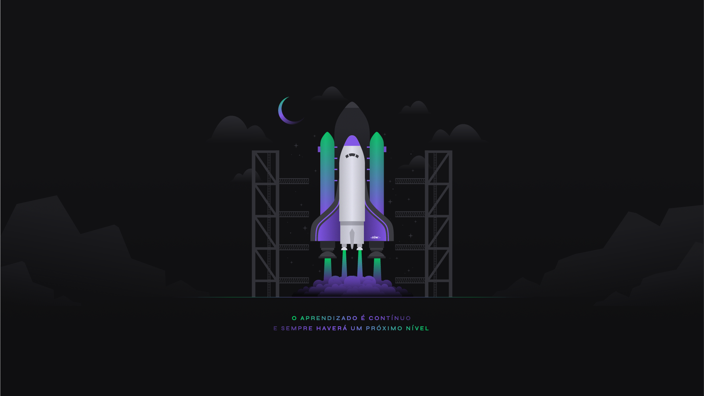

<h1 align="center">
    MOVE.IT
</h1>

<h1 align="center">
  
</h1>

## 💻 Projeto 💻

O Move.it foi criado com intuito de te ajudar a ter concentração, utilizando a técnica Pomodoro, e ao finalizar o time
é oferecido desafios para te ajudar nos intervalos de descanso.

## 🚀 Tecnologias 🚀

Foi desenvolvido com as seguintes tecnologias:

- Next.js
- Node.js
- React
- React Native
